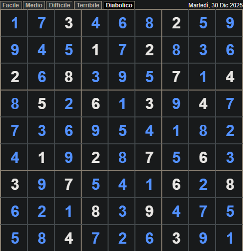
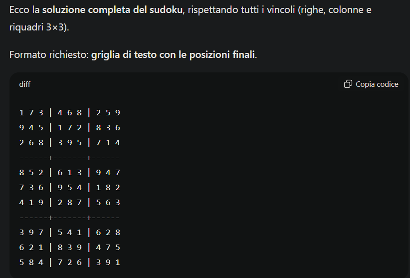

# Sudoku

## Prompt: "risolvi questo sudoku, il formato finale deve essere una griglia di testo che mosti le posizioni. si tratta di un sudoku a livello difficile e i numeri che vedi nella griglia sono i vincoli. ti ricordo le regole, in una riga, colonna o nello stesso riquadro 3x3 non può apparire lo stesso numero due o più volte."

nella versione precedente il prompt era più generico **"risolvi questo gioco"**.

# risultato

Il gioco del sudoku ha mandato in crisi molte LLM, in particolare quelle che non hanno una buona capacità di ragionamento logico.

Grazie però a questa formulazione del prompt, Chat GPT-4 ha risolto il sudoku al primo tentativo.
Subito corretto

# Altri esempi di ricerca

