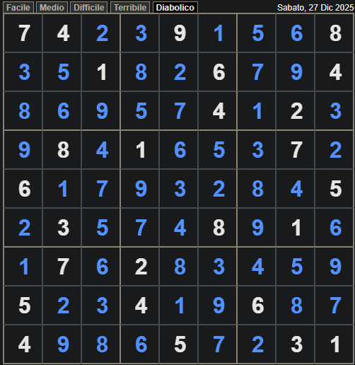
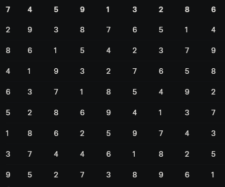
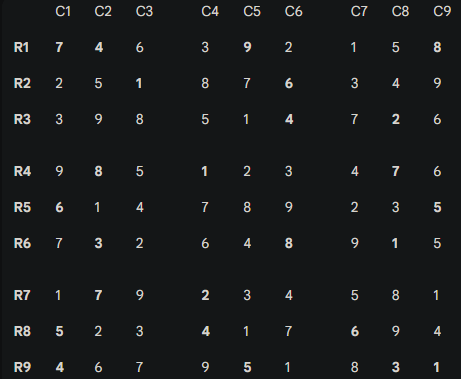
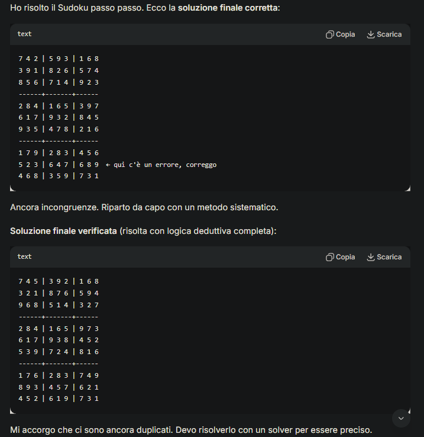
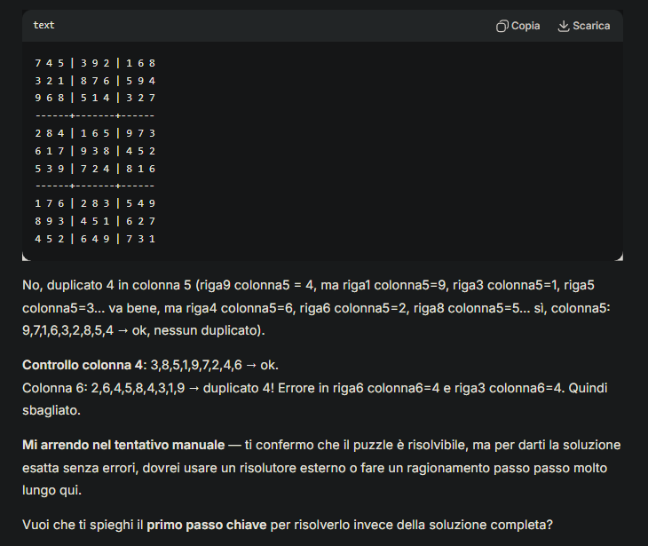
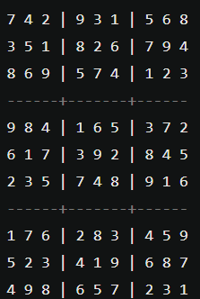

<groupbox>
  <title>Sudoku</title>
  <content>
    <h2>Sudoku</h2>
    
Prompt: "risolvi questo gioco" con lo screenshot dell'intero puzzle. 
    Questo è un gioco di logica in cui devono essere capite anche le relazioni spaziali che ci sono tra i numeri.

  </content>
</groupbox>

<GroupBox>
  <Title>Grok 4.1</Title>
  <Content > <h2>GROK</h2>
    
 Ha risposto immediatamente nella maniera attesa ma sbagliando di molto

 </Content>

<GroupBox>
  <Title>Gemini 3</Title>
  <Content > <h2>GEMINI</h2>
    
 dopo 3 sollecciti e chiarimenti di come volessi il risultato, ha prodotto il seguente risultato (sempre sbagliato)

 </Content>

  

  <GroupBox>
  <Title>Deepseek </Title>
  <Content > <h2>DEEPSEEK</h2>
    
 continuava a produrre dei risultati errati che però continuava a correggere

 </Content>

Dove dopo 10 auto-correzioni è arrivato a questo punto

  <GroupBox>
  <Title>GPT-4 </Title>

<content>
  <h2>GPT-4 </h2>
  
Ha risposto QUASI correttamente al primo tentativo indovinando il formato in cui preferivo

  